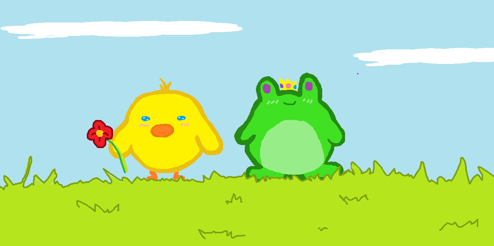

## Hello-world
# Vanessa Karina Juarez Garza
## Carrera ITC

**hola**
*hola botino*

1. Github
2. Hola
3. Nuevo

- Hello
- World

```c++
//Vanessa Karina Juarez Garza
//A00834795
/*Aprendizaje:
Aprendi mas sobre este lenguaje de programacion, aprendi a hacer clases, constructores y demas. Aunque todavia le batallo al tema de arreglos, estoy segura que al final de cuenta si voy a aprender a manejarlo. Una cosa que quisiera saber es como corregir mis errores pero fuera de eso todo bien :D
*/
#include <iostream>
#include "Serie.h"
#include "Episodio.h"
using namespace std;

void leerDatosSerie( std::string &_id, std::string &_titulo, int &_duracion, std::string &_genero, double &_calificacionPromedio, int &_cantEpisodios){

	cout<< "Ingresa el id: ";	
	cin>> _id;
	cout<< "Ingresa el titulo: ";
	cin>> _titulo;
	cout<< "Ingresa la duracion (minutos totales): ";
	cin>> _duracion;
	cout<< "Ingresa el genero: ";	
	cin>> _genero;
	cout<< "Ingresa la Calificacion Promedio: ";
	cin>> _calificacionPromedio;
	cout<< "Ingresa la cantidad de Episodios: ";
	cin>> _cantEpisodios;
}
```
___
[Favorite Song](https://youtu.be/D9G1VOjN_84)


| Nombre Amigos | Clases con ellos |
| ----------- | ----------- |
| Juan | 1 |
| Adrian | 3 |

- [x] Tacos
- [ ] Rajas con queso
- [ ] Chilaquiles
